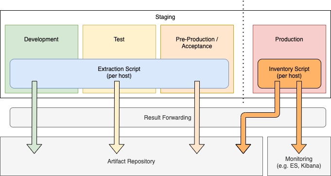

# metaeffekt-extraction-script

Scripts for extracting detailed information from a host.

The script should only be run in non-production environments, as it collects a
significant amount of data and is somewhat heavy computationally.

The script aggregates data in ``/var/opt/metaeffekt/extraction/analysis``.

For aggregating lower-profile inventory data, possibly from production environments,
look at the [{metæffekt} inventory script](https://github.com/org-metaeffekt/metaeffekt-inventory-script).



This figure illustrates how the script can be applied in a staged environment.

## Linux

### Running the script

#### Optional Arguments:

- `-t <machineTag>` : Adds a tag to be stored with the analysis.
  <br>
  This exists so that a custom Identifier can be set.
  It should consist only of characters as allowed for base64 encoded strings
  (alphanumeric plus . and /).
- `-e <pattern>` : Exclude the path denoted by the pattern.
  <br>
  The pattern follows the rules that the command `find` uses for its `-path` options (which aren't always intuitive).
  <br>
  For directories without overly odd characters, however, it works something like this:  
  `-e "/do/not/traverse/this/directory" -e "/other/patterns*/to/exclude"`  
  Take care to not include trailing slashes in your exclude paths, as `find` doesn't cope with it very well.
- `-u <user>` : user to drop privileges to.
  <br>
  This is used with some commands that collect data specific to some users. Notably, this is used to rerun docker images and ps commands to explore user environments and output installed containers. Usernames should follow the unwritten laws of reasonable usernames, most notably not starting with a hyphen.
  <br>
  Doesn't support multiple users yet.
  Use this to run analysis on yourself or another important user for which you wish to include data. Currently only supports a single

## Windows

The [scripts-windows](scripts-windows) folder contains multiple PowerShell scripts that are all required to run the
extraction script on Windows. Only the [windows-extractor.ps1](scripts-windows/windows-extractor.ps1) script needs to
be executed. The other scripts are called by the main script.

### Running the script

```powershell
.\windows-extractor.ps1 -OutDir result
```

#### Optional arguments:

- `-FsScanBaseDir` : The base directory for the filesystem scan. This is the directory that will be scanned for files
  and directories. The default value is `(Get-WmiObject Win32_OperatingSystem).SystemDrive` or if that fails,  `C:\`.
- `FsScanExcludeDirs` : A string consisting of directories split by `;;;` to exclude from scanning into during the
  file system scan: `"dir1;;;dir2;;;dir3"`

### Result processing

The results can be converted into an inventory of software components using the `extract-windows-inventory` goal of
the `org.metaeffekt.core` : `ae-inventory-maven-plugin` plugin.

## License

- The files in the [scripts-windows](scripts-windows) are licensed under the [MIT license](LICENSE.MIT).
